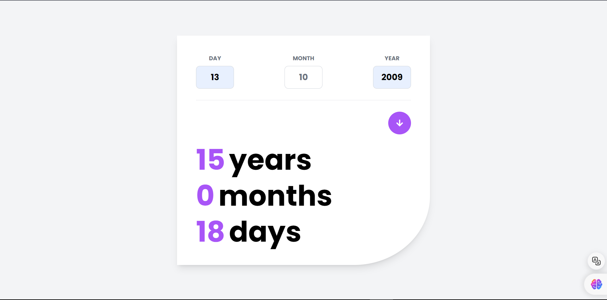

# Age Calculator App

 <!-- Replace with the actual path to your image -->

## Description

The Age Calculator App allows users to easily calculate their age in years, months, and days based on their birthdate. It’s user-friendly and designed to handle various date formats, leap years, and edge cases.

## Features

- Calculate age in years, months, and days.
- Handles leap years and varying month lengths.
- User-friendly interface with clear input fields and output display.
- Responsive design for use on both desktop and mobile devices.

## Technologies Used

- **HTML**: For the structure of the app.
- **Tailwindcss**: For styling and layout.
- **JavaScript**: For implementing the age calculation logic.
- **Responsive Design**: Utilizes media queries for compatibility across devices.
- **Date Handling**: Employs JavaScript's built-in Date object for accurate calculations.
- **Blackbox AI**: For designing page.
## Usage

1. Enter your birthdate in the provided input field.
2. Click the "ARROW(⬇)" button.
3. Your age will be displayed in years, months, and days.

## Acknowledgments

- Inspired by various online age calculators / Frontend Mentor.

